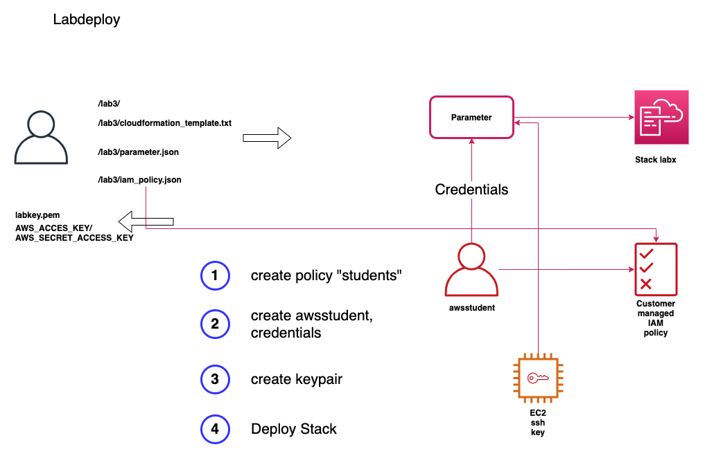

# labs

Create AWS CloudFormation lab environment with convention based configuration.

1) A user is created, named `awsstudent`
1) Access key and secret for the user is created
1) Key and secret written to "credentials.txt"
1) An EC2 ssh key is created, named `labkey`
1) The ssh key is written to `labkey.pem`
1) The CloudFormation template is taken from the path `lab${x}/cloudformation_template.txt`
1) The policy file `lab${x)/iam_policy.json` is 
    - created as policy `lab${x)-policy``
    - attached to the user
1) Info log file `log/cfd.log` is written

## Overview



## AMI search results

If the template references an AMI, you have to replace it.

from

```yaml
  AWSAmiId:
    Description: The name of the Windows AMI to find based on search
    Type: String
    Default: 'x86_64,Windows_Server-2012-R2_RTM-English-64Bit-Base'
Resources:
...
```

to
```yaml
  AWSAmiId:
    Description: The name of the Windows AMI to find based on search
    Type: String
    Description: 'x86_64,Windows_Server-2012-R2_RTM-English-64Bit-Base'
    Default: 'ami-06032c95ea1ffa069'
Resources:
...
```

```bash
aws ssm get-parameters-by-path \
    --path /aws/service/ami-windows-latest \
    --query 'Parameters[].[Name,Value]'
```

